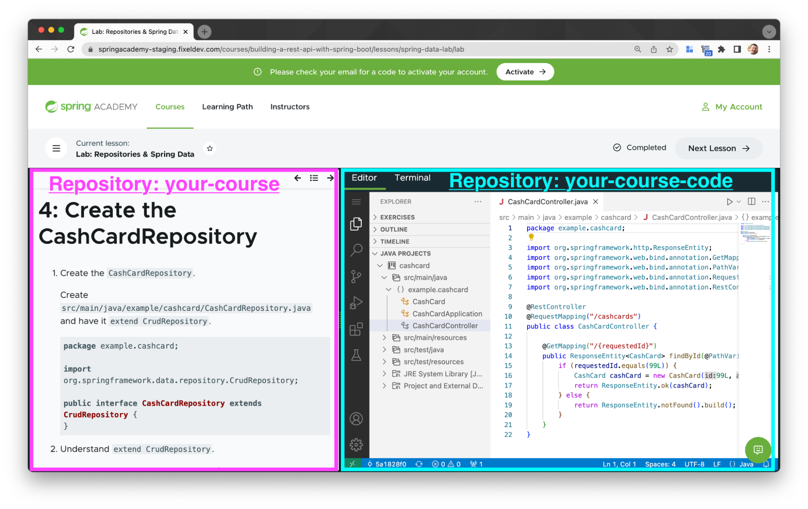
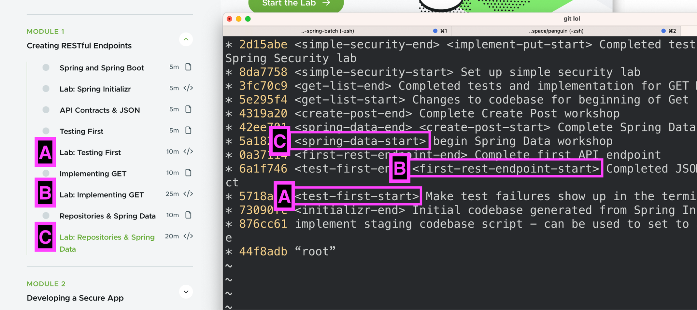
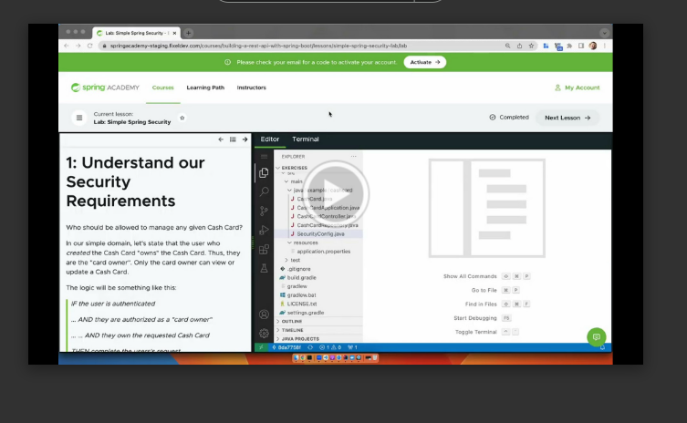

# Authoring Labs

Courses usually contain hands-on labs or "workshops". This guide will help you author labs which are hosted in a browser-based environment called [Educates](https://educates.dev).

By default, Educates supports a lab instruction pane, a Terminal, and a VSCode editor. Please look at the relevant Educates [installation](https://docs.educates.dev/en/stable/installation-guides/cluster-requirements.html)
and [getting-started](https://docs.educates.dev/en/stable/getting-started/quick-start-guide.html) instructions..

<kbd></kbd>

### Lab authoring style guide

Please reference the [**Spring Academy Lab Style Guide**](lab-authoring-style-guide.md) for guidance on topics such as but not limited to:

- Lab format
- Patterns to follow, and to avoid
- Examples

### Installing Educates locally

**_Installing Educates is a prerequisite_** for local lab development. There is a lot of documentation about this, but in our experience you need to do the following:

- Install Docker
- Install kind
- Install kubectl
- Install carvel tools ([link](https://carvel.dev/imgpkg/docs/v0.36.x/install/))
- [Download and install the Educates CLI](https://docs.educates.dev/getting-started/quick-start-guide.html#downloading-the-cli). Note that OS X does not recognize this as a trusted tool and you'll have to allow it in your System Preferences.
- [Install the Educates Cluster](https://docs.educates.dev/getting-started/quick-start-guide.html#local-kubernetes-cluster)

### Running labs in your local Educates

Once you have lab files ready (see instructions below) you can deploy and interact with your lab in your locally running Educates.

1. Run `make` to deploy or update the training portal and workshops (labs).

   ```bash
   > make

   imgpkg push -i localhost:5001/course-spring-academy-sample-files:latest -f .
   dir: .
   file: .DS_Store
   ...
   workshop.training.educates.dev/spring-academy-sample-course-first-lab configured
   workshop.training.educates.dev/spring-academy-sample-course-nth-lab configured
   ...
   deployment "training-portal" successfully rolled out
   ```

1. Access the labs via the training portal URL:

   ```bash
   > kubectl get trainingportal

   kubectl get trainingportal
   NAME             URL                                             PORTALPASSWORD   ADMINUSERNAME   ADMINPASSWORD            STATUS    MESSAGE
   spring-academy   http://spring-academy-ui.192.168.0.196.nip.io                    educates        GenderatedPasswordHere   Running
   ```

   Find and access the `.nip.io` url in the output; for example `http://spring-academy-ui.<IP-ADDRESS>.nip.io`.

1. Rerun `make` anytime to update the educates workshops.

**Troubleshooting Note:** The Educates cluster might not be accessible if your network changed, such as a different WiFi or ethernet network. Deleting and recreating your Educates cluster is the most practical solution.

```bash
$ educates delete-cluster
$ educates create-cluster
$ make
```

### Lab file structure

Educates dictates that labs (workshops) live in the `workshops/` directory and have a specific structure.

For example:

```
├── resources
│ └── trainingportal.yaml
├── workshops
│ ├── 01-getting-started
│ │ ├── resources
│ │ │ └── workshop.yaml
│ │ ├── workshop
│ │ │ ├── content
│ │ │ │ ├── 01-overview.md
│ │ │ │ ├── 02-install-dependencies.md
│ │ │ │ ├── 03-create-hello-world.md
│ │ │ │ └── 04-summary.md
│ │ │ ├── setup.d
│ │ │ ├── modules.yaml
│ │ │ └── workshop.yaml
```

Let's break down these files:

- `resources/trainingportal.yaml`

  Educates Kubernetes file **_used for local development only_** that describes the labs/workshops that are available to be hosted and served by Educates. Follow the pattern here and refer to the Educates documentation for more details.

  Notes:

  - `spec:workshops` listings must match `metadata:name` workshop name in `workshops/nn-lab-topic/resources/workshop.yaml`

- `workshops/nn-lab-topic/`

  Author-friendly lab folder name. You can name these however you like. Prefixing with numbers is for convenance only.

- `workshops/nn-lab-topic/modules.yaml`

  Describes the title (name) and action-button for each instructional page in this lab.

- `workshops/nn-lab-topic/workshop.yaml`

  Lists the "active" instructional pages for this lab. Usually matches listing in `modules.yaml`

- `workshops/nn-lab-topic/resources/workshop.yaml`

  Educates Kubernetes file **_used for local development only_** that describes details about how your lab should be hosted by Educates. Follow the pattern for your own labs. Review the Educates documentation for more details.

  Special Notes:

  - `metadata:name` must match listing in `resources/trainingportal.yaml`
  - Make sure all paths with `/workshops/nn-lab-topic` match this lab's folder structure.
  - Edit the `LESSON_LABEL` variable in `spec:session:env` to match the Lesson Label for this lab. [Matching labs with code](#matching-labs-with-code).

- `workshops/nn-lab-topic/content/<page>.md`

  Individual lab instruction pages. Naming and numbering for convenance only and no pattern is required.

  Recommendation:

  - `01-overview.md`: Overview of the lab and/or summary of any changes since the previous lab.
  - `nn-lab-pages.md`: Any number of instructional pages in sequence.
  - `nn-summary.md`: A summary page that wraps up the lab.

### Lesson Labels: Matching lab instructions with code

We usually utilize two Git repositories for course development:

- Lesson and lab instruction repository. Example: [Sample Course content repository](https://github.com//course-spring-academy-sample)
- A code repository with code used in the labs. Example: [Sample Course code repository](https://github.com//course-spring-academy-sample-code).

So, when a learner launches a lab, how do we make sure the correct code is loaded with the correct lab instructions given the two live in different repositories? The answer is a concept we invented called "lesson labels".

<kbd></kbd>

#### How to use Lesson Labels

A lesson label is just that: a well-named label that clearly indicates a starting or ending point of a lesson (well, a lab; maybe we should have called them "lab labels" but anyway... 😉).

Both the content and code repos reference the same label to associate the code starting point for each workshop. Be descriptive!

For example, `spring-data-start` indicates the code starting-point for a lab named "Spring Data", `simple-spring-security-start` for a a lab named "Simple Spring Security", etc.

#### Lesson Label Example

Imagine we have a lab named "Your First Lab".

**In the code repo:** add the Lesson Label `<first-lab-start>` prefix in the commit message for the SHA that the "Your First Lab" should load:

```shell
# in the code repo...
$> git log --oneline
...
* 7dfcc9d <nth-lab-start> Initial state of another lab
* 05717ad <first-lab-end> Solution to first lab
* 2ec1740 <initializr-end> <first-lab-start> Codebase from Spring Initializr
...
```

**In the content repo workshop definition(s)**: specify a `LESSON_LABEL` env var of `first-lab-start` (no angle brackets!) under `spec: session: env:`

```yaml
spec:
  title: Your first lab
  ...
  session:
    env:
    - name: LESSON_LABEL
      value: first-lab-start
```

When the workshop loads, a custom process executes and the `LESSON_LABEL` env var will be used to check out the code repo Git SHA with the matching `LESSON_LABEL` in the commit message. With that, the workshop exercise starts at the correct SHA.

#### Why not put the lab instructions and code in the same repository? Why not using branches instead of lesson labels?

Past incarnations of the Tanzu education implemented several variations of storing lab instructions and code in the same repository. Some solutions used a complex branching strategy, others implemented a separate copy of the code-codebase for each lab.

We found that the benefits (e.g. one less repo) did not outweigh the cost and complexity of maintaining these solutions. This is because lab instructions use trunk-based or PR-based development (that is, commits to `HEAD`), while the code repos require frequent history-rewriting rebases to craft a perfect codebase for the lab. Mixing these two strategies in one codebase would be a nightmare.

The Spring Academy team is happy to discuss this in more detail.

That said: feel free to innovate! If you discover a sustainable, minimally complex single-repo solution please let us know.

Speaking of which...

#### Fixing history and rebasing

**Upshot:** do an interactive rebase to update the codebase history as needed (NOT the article lessons or lab instructions). Coordinate with your team so they know you're doing it.

[🎥 Watch this video](https://drive.google.com/file/d/1_-IGX_7NhKS1vjSB2Sdd4ErUVuvH9FiE/view)

[](https://drive.google.com/file/d/1_-IGX_7NhKS1vjSB2Sdd4ErUVuvH9FiE/view)
