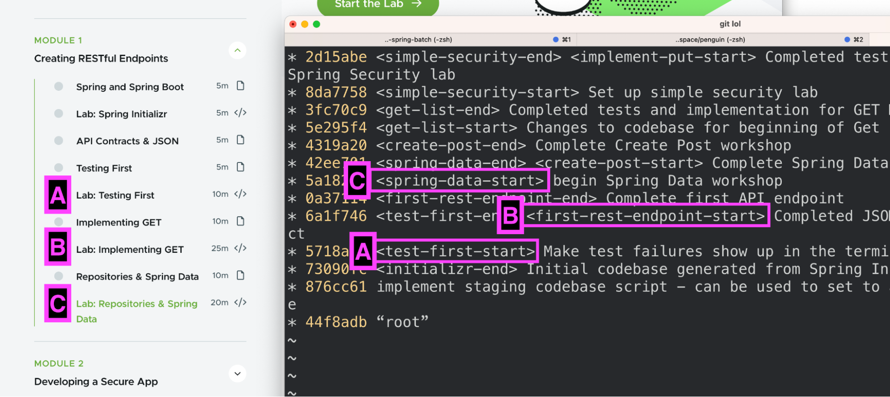

# Spring Academy Lab Style Guide

Authoring labs is not the same as authoring documentation, quick-start guides, blog posts, or other forms of technical content.

A lab's purpose is to _teach concepts and practical knowledge through hands-on implementation._ It's not enough to instruct a learner to perform a task – the goal is to teach them usable skills they will retain and can repeat in their own work. They don't need to just do it, they need to _learn it_.

## Authoring Lab instructions

Lab instructions are the step-by-step instructions a learner follows to complete a lab.

### Remember: you're building a real application

Spring Academy reinforces real-world, practical learning using a project-based approach. You should name, structure, and build your labs as if you were building real applications.

For example:

- Use realistic package names but prefixed with `example` to avoid collisions with actual projects.
- Don't use cliche fake terms, such as "foo", "bar", "thing", "widget", etc.
- Use realistic class names with a realistic domain. Avoid obviously placeholder names such as `MyController`, `SampleBean`, `ExampleClass`, etc.
- Don't build Hello World.
- Do not use Lesson, Course, or similar learning-platform terms to name your artifacts such as `class Lesson1` or `class TestsForLesson1` etc.

<kbd></kbd>

### Try to use the Family Cash Card domain

Remember the Pet Clinic? How about the Animal Rescue app?

Spring Academy has the [Family Cash Card business domain](https://springacademy-staging.fixeldev.com/courses/building-a-rest-api-with-spring-boot/lessons/introduction#what-will-you-build).

> You can think of the cash card being very similar to a gift card that many of us send and receive. The primary goal of the Family Cash Card app is to give parents ease and control over managing funds for their children.

<kbd></kbd>

For consistency and familiarity of the learner experience across courses, many Spring Academy courses use the Cash Card domain in their application. Some have even started with a [copy the codebase](https://github.com//course-spring-brasb-build-a-rest-api-code).

Using the cash card domain is not a requirement, but highly recommended.

Since the domain is so similar the credit card domain, most Spring projects have some way to fit in. Are the concepts you're teaching relevant in the credit card industry? They probably are. We're flexible and are happy to brainstorm on how your application can fit in the cash card domain.

### Reinforce the project domain

In the real world your team would be constantly talking about how and why what you're working on helps the project's goals. Talk about how the lab is helping solve a problem in the project domain.

<kbd></kbd>

### Make no assumptions, especially for beginners

In real life we make assumptions all the time about what people know; when we get those assumptions incorrect, we can have a conversation about it.

But, Spring Academy is an _on-demand, self-paced, asynchronous learning environment_. You are not present in real time to answer questions or clarify assumptions. For these reasons and others, be extremely explicit about what the learner needs to do.

For example:

- Don't say things like "make the class" without telling them exactly where to create it.
- Have the learner create artifacts where they should be in a real project.
- Be explicit about all `import` statements needed for the code they are writing. Your IDE might have done this for you, but the web-based VScode editor might not.

  <kbd></kbd>

### Capitalize on "learning moments"

A _learning moment_ is a small but powerful opportunity for a learner to internalize something new and important. These often present themselves as errors to fix, simple looking but powerful method calls, framework-provided "magical" functionality, and other seemingly innocuous but powerful aspects of your application.

It is an impactful learning tool to have a learner make small changes and observe how the system (and tests) change in response to those actions.

Opportunity for learning moments include:

##### Learning moment: Breaking up big blocks of code

Ask yourself: do you write huge blocks of code all at once, or do you build up functionality bit-by-bit to make sure it works?

Resist the temptation to copy-paste big blocks of code (especially multiple methods) from your completed lab solution into the instructions and then tell the learner to duplicate them.

Instead, have the learner build up the functionality and tests incrementally. This allows you the opportunity to teach each part in turn, and for the learner to observe how the system behaves as each piece is added – even if the results are errors and failures. Again: observing errors and failures, _then fixing them_, is a power learning tool.

<kbd></kbd>

<kbd></kbd>

##### Learning moment: Introduce mistakes or errors on purpose

Ask yourself: When implementing an application such as this, what mistakes have you yourself made? Would someone experiencing them in this lab (and being guided on how to detect and fix them) help a beginner learn more about working with this Spring project?

Purposely have the learner implement the code incorrectly (you might even tell them you are doing so ahead of time) so they can experience how the system (and tests) react to such errors.

For example, return a blatantly incorrect value, incorrect status code, omit an error-checking condition, etc.

<kbd></kbd>

##### Learning moment: Consider entire Learning Moment sections

Ask yourself: what were you surprised by, shocked by, or even upset by regarding this Spring project? Is there an opportunity to share this with the learner?

Sometimes a concept, error condition, unexpected framework defaults/configuration, or similar situations warrant an entire aside just about them. Consider adding a learning moment section dedicated to these concepts.

BUT: don't go overboard! If everything is a super important learning moment then they lose their impact.

<kbd></kbd>

### Use numbered steps

We received feedback that the numbered steps make it easy to know exactly what to do and when.

Be sure to use proper Markdown ordered-list format:

```markdown
1. Update the Controller.

   <text here>

1. Understand the Spring Web annotations.

   <text here>
```

<kbd></kbd>

### Build functionality up with small steps and explain

Especially for a beginner, do not assume they know very much about the technology.

<kbd></kbd>

### Short explanations in context; avoid verbosity

Article lessons are the place for verbose, multi-paragraph explanations. Labs are the place where we put an Article's concepts into practice.

If you find yourself writing long blocks of text in the Lab, ask yourself: should this content be in an accompanying Article instead?

<kbd></kbd>

<kbd></kbd>

Note: sometimes the answer is YES, you do need a verbose explanation.

For example:

- Explaining non-obvious implementation decisions.
- Explaining why you are _not_ doing something in the lab that you might do in a real project.

  <kbd></kbd>

### Tests are required

Testing is a first-class aspect of Spring Academy, not an afterthought.

Always give careful consideration to your tests, and build your tests up bit-by-bit as you build your lab, just as you would build your tests incrementally as you implement functionality in a real project.

<kbd></kbd>

<kbd></kbd>

<kbd></kbd>

Bonus: use TDD when possible 😉. We've received a lot of positive feedback about TDD usage in labs.

## Lab Code and Code Repositories

Courses usually have an accompanying codebase that represents the real-world style project where the learner implements the concepts they are learning.

The course's code repository represents _an ideal, bug-free implementation_ of all lab concepts taught in the course, with only commits representing starting points and ending points (solutions) for labs.

<kbd></kbd>

### Common Repositories

Repository: **`your-course`**

- Spring Academy-hosted Articles
- Educates-hosted Lab instructions
- Example: [course-spring-academy-sample](https://github.com//course-spring-academy-sample)

Repository: **`your-course-code`**

- Educates-hosted code used as starting points or ending solutions for labs. Individual labs almost always start at a particular code commit that the learner then extends with additional functionality as instructed.
- Example: [course-spring-academy-sample-code](https://github.com//course-spring-academy-sample-code)

<kbd></kbd>

#### Why not put the lab instructions and code in the same repository?

Past incarnations of the Tanzu education implemented several variations of storing lab instructions and code in the same repository. Some solutions used a complex branching strategy, others implemented a separate copy of the code for each lab.

We found that the benefits (e.g. one less repo) did not outweigh the cost and complexity of maintaining these solutions. The root of the complexity came from the fact that the lab instructions used traditional trunk-based or PR-based development, while the code repos required frequent history-fixing rebases. The Spring Academy team is happy to discuss this in more detail.

That said: feel free to innovate! If you discover a sustainable, minimally complex single-repo solution please let us know.

### Lesson Labels: matching lab instructions with code repositories

Just as a course introduces concepts incrementally, the learner implements those concepts incrementally in labs.

Unlike a real project, the learner does not commit and push their code to a repository. Instead, the course author provides the learner with starting points where the project code is ready for the learner to start implementing whatever concept is being taught in the current lab. We call these starting and ending points _Lesson Labels_.

Learn more about Lesson Labels and how to use them in the [main Lab Guide](authoring-labs.md#matching-labs-with-code).

<kbd></kbd>

### Making changes to past Lab code

**_TL;DR:_** check out the commit where you need to make the code changes, then rebase the change through all future commits. Force-push the branch to make the repository perfect again.

Watch this [video](TODO upload cloud provider) to learn how to use git interactive rebase to fix lab codebases.
